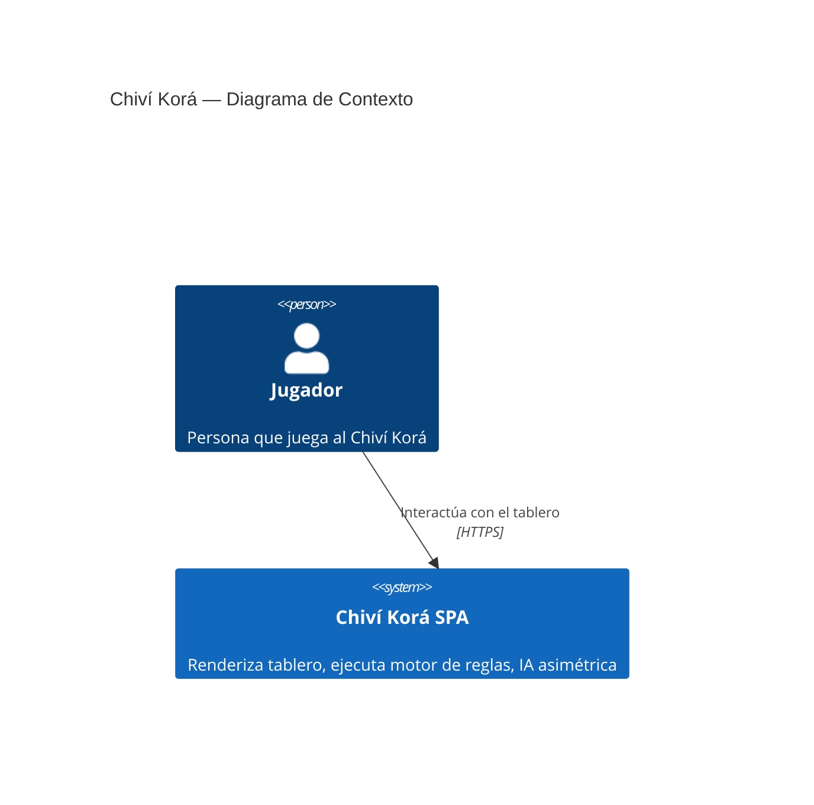
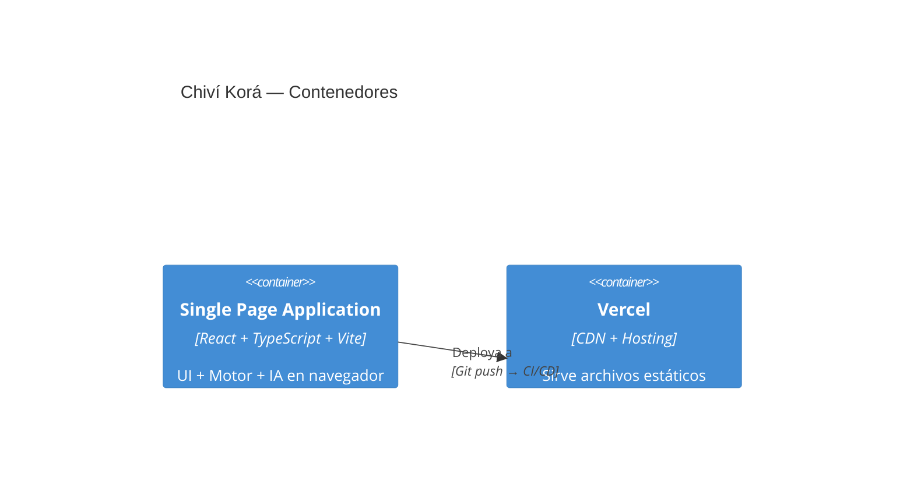
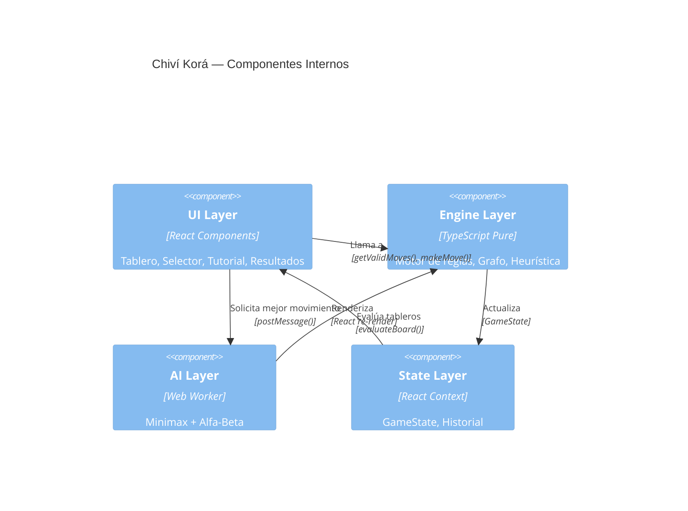

# Arquitectura: Chiví Korá — Plataforma Web Interactiva

> **Versión:** 1.0.0 · **Stack:** React 18 + TypeScript + Vite + SVG + Vercel · **Arquitecto:** Hermes Agent

---

## 1. Decisión de Stack

| Capa | Tecnología | Justificación |
|:--|:--|:--|
| **Frontend** | React 18 + TypeScript | Tipado estricto para motor de reglas complejo. React por ecosistema y familiaridad del equipo. |
| **Build** | Vite | Fast HMR, tree-shaking, bundle optimizado. Mejor DX que CRA. |
| **Renderizado** | SVG (react-konva opcional) | Tablero como grafo de nodos/aristas. SVG nativo permite interactividad sin overhead de Canvas. |
| **Testing** | Vitest + Testing Library | Compatible con Vite, rápido, misma API que Jest. |
| **IA** | TypeScript puro + Web Worker | Minimax en thread separado para no bloquear UI. Sin librerías externas. |
| **Hosting** | Vercel (plan gratuito) | Deploy automático desde Git, SSL, CDN global, serverless functions si se necesitan en v2. |
| **CI/CD** | GitHub Actions | Build + test + deploy en push a `main`. Gratuito para repo público. |
| **Lenguaje** | TypeScript (strict mode) | Seguridad de tipos en motor de reglas. Evita bugs de null/undefined en el grafo. |

**Por qué no otras opciones:**

- ❌ **Vanilla JS**: Sin tipado, el motor de reglas se vuelve frágil con la complejidad del grafo asimétrico.
- ❌ **Canvas**: Más complejo para interactividad (hit detection manual). SVG tiene eventos nativos por elemento.
- ❌ **Next.js**: Overkill para SPA sin backend. Vite es suficiente.
- ❌ **n8n**: No aplica. Sin integraciones externas, sin flujos de automatización.
- ❌ **Supabase/BD**: No hay persistencia en MVP. Estado 100% en memoria.

---

## 2. Diagrama de Componentes







---

## 3. Modelo de Dominio

### 3.1 Bounded Context: `GameEngine`

Es el único bounded context del MVP. No hay separación adicional porque todo es una SPA monolítica sin backend.

### 3.2 Aggregates

**Aggregate Root: `Game`**

```
Game (aggregate root)
├── Board (entity)
│   ├── Node[] (25 nodos)
│   └── Edge[] (aristas = conexiones válidas)
├── Pieces[] (value objects)
│   ├── Yaguarete (1)
│   └── Perro[] (15)
├── Turn (value object)
│   └── currentPlayer: 'yaguarete' | 'perros'
├── MoveHistory (value object)
│   └── Move[]
└── GameStatus (value object)
    └── 'playing' | 'perros_win' | 'yaguarete_win'
```

### 3.3 Entidades y Value Objects

```typescript
// === Value Objects ===

type Player = 'yaguarete' | 'perros';

interface Node {
  id: number;           // 0-24
  x: number;            // coordenada SVG
  y: number;
  zone: 'main' | 'cueva';
}

interface Edge {
  from: number;         // node id
  to: number;
  direction?: 'forward' | 'backward' | 'lateral' | 'diagonal';
}

interface Piece {
  type: 'yaguarete' | 'perro';
  nodeId: number;       // nodo actual
  captured: boolean;
}

interface Move {
  piece: Piece;
  fromNode: number;
  toNode: number;
  capture?: number;     // nodeId del perro capturado, si aplica
}

type GameStatus = 'playing' | 'perros_win_encerrado' | 'perros_win_acorralado' | 'yaguarete_win_umbral';

// === Aggregate Root ===

interface GameState {
  board: Board;
  pieces: Piece[];
  currentTurn: Player;
  moveHistory: Move[];
  status: GameStatus;
}

// === AI Config ===

type Difficulty = 'facil' | 'dificil';
type PlayerChoice = 'yaguarete' | 'perros';

interface AIConfig {
  playerControls: PlayerChoice;
  difficulty: Difficulty;
}
```

### 3.4 Eventos de Dominio (internos)

```
MoveMade { piece, from, to, capture? }
CaptureHappened { capturedPiece, byYaguarete }
VictoryDetected { winner: Player, reason: 'acorralamiento' | 'umbral_7_perros' }
TurnChanged { newTurn: Player }
GameReset { }
```

---

## 4. Contratos del Motor (API Pública)

La "API" del engine son funciones puras exportadas desde `/src/engine/`. No hay REST endpoints.

### 4.1 `getValidMoves(gameState: GameState, nodeId: number): number[]`

**Propósito:** Dado un nodo con una pieza, retorna los nodos destino válidos.

**Reglas:**
- Si la pieza es `perro` y no es su turno → `[]`
- Si la pieza es `yaguarete` y no es su turno → `[]`
- Perro: solo aristas con dirección `forward` o `lateral` (nunca `backward`)
- Yaguareté: todas las aristas desde el nodo
- Yaguareté puede capturar: si nodo adyacente tiene perro Y el nodo siguiente en línea recta está vacío → incluir ese nodo como captura

**Contrato:**
```typescript
// Input: gameState válido, nodeId de una pieza del jugador actual
// Output: array de nodeId destino (vacío si no hay movimientos)
// Side effects: NINGUNO (función pura)
```

### 4.2 `makeMove(gameState: GameState, fromNode: number, toNode: number): GameState`

**Propósito:** Ejecuta un movimiento y retorna el nuevo estado.

**Reglas:**
- Valida que el movimiento sea legal (usa `getValidMoves` internamente)
- Si es captura: marca el perro intermedio como `captured: true`
- Alterna el turno
- Detecta condición de victoria post-movimiento
- Actualiza historial

**Contrato:**
```typescript
// Input: gameState actual, fromNode (pieza a mover), toNode (destino)
// Output: NUEVO GameState (inmutable)
// Throws: MoveError si movimiento ilegal
// Side effects: NINGUNO (función pura)
```

### 4.3 `detectVictory(gameState: GameState): GameStatus | null`

**Propósito:** Evalúa si la partida terminó.

**Algoritmos:**
1. **Acorralamiento:** BFS desde nodo del yaguareté. Si `getValidMoves()` retorna `[]` → `perros_win_acorralado`
2. **Umbral 7 perros:** Contar `pieces.filter(p => p.type === 'perro' && !p.captured).length`. Si ≤ 7 → `yaguarete_win_umbral`
3. Si ninguna condición → `null` (sigue jugando)

**Contrato:**
```typescript
// Input: gameState post-movimiento
// Output: GameStatus si terminó, null si sigue
// Side effects: NINGUNO
```

### 4.4 `evaluateBoard(gameState: GameState, forPlayer: Player): number`

**Propósito:** Heurística de evaluación para Minimax. DIFERENCIADA por rol.

**Heurística del yaguareté (maximizar):**
```
score = (capturas_disponibles * 100) 
      + (movilidad * 10)                  // cantidad de movimientos válidos
      - (perros_cercanos * 5)             // perros a distancia 1-2
      + (perro_capturable * 50)           // perro adyacente con escape detrás
```

**Heurística de los perros (minimizar score del yaguareté):**
```
score = -(capturas_disponibles_yaguarete * 100)
      - (movilidad_yaguarete * 10)
      + (compresion * 30)                 // qué tan rodeado está el yaguareté
      + (flancos_cubiertos * 20)          // perros en posiciones de flanco
      + (perros_vivos * 15)               // bonus por mantener perros
```

**Contrato:**
```typescript
// Input: gameState a evaluar, forPlayer (quién está evaluando)
// Output: número (positivo = favorable al yaguareté, negativo = favorable a los perros)
// Side effects: NINGUNO
```

### 4.5 `findBestMove(gameState: GameState, config: AIConfig): Move`

**Propósito:** IA: encuentra el mejor movimiento usando Minimax con poda alfa-beta.

**Implementación:**
```typescript
function minimax(
  state: GameState, 
  depth: number, 
  alpha: number, 
  beta: number, 
  maximizing: boolean
): number {
  if (depth === 0 || state.status !== 'playing') {
    return evaluateBoard(state, maximizing ? 'yaguarete' : 'perros');
  }
  
  const moves = getAllValidMoves(state);
  
  if (maximizing) {
    let maxEval = -Infinity;
    for (const move of moves) {
      const newState = makeMove(state, move.from, move.to);
      const eval = minimax(newState, depth - 1, alpha, beta, false);
      maxEval = Math.max(maxEval, eval);
      alpha = Math.max(alpha, eval);
      if (beta <= alpha) break; // poda
    }
    return maxEval;
  } else {
    // ... simétrico para minimizing
  }
}
```

**Parámetros por dificultad:**
| Nivel | Profundidad | Poda |
|:--|:--|:--|
| Fácil | 3 | Sí (alfa-beta) |
| Difícil | 5 (ajustable a 4 si > 2s) | Sí, con ordenamiento de movimientos |

**Contrato:**
```typescript
// Input: gameState actual + AIConfig (rol del jugador humano + dificultad)
// Output: Move (fromNode, toNode) — el mejor movimiento según la IA
// Tiempo: < 2s en nivel difícil (ejecutado en Web Worker)
// Side effects: NINGUNO
```

---

## 5. Estructura del Proyecto

```
chivi-kora/
├── public/
│   └── favicon.svg
├── src/
│   ├── engine/                  # Motor de juego (PURO, sin React)
│   │   ├── graph.ts             # Definición del grafo (nodos + aristas)
│   │   ├── rules.ts             # getValidMoves(), makeMove()
│   │   ├── victory.ts           # detectVictory()
│   │   ├── heuristic.ts         # evaluateBoard()
│   │   ├── ai.ts                # Minimax + alfa-beta
│   │   └── types.ts             # GameState, Move, Player, etc.
│   ├── ui/                      # Componentes React
│   │   ├── App.tsx
│   │   ├── Board.tsx            # Renderizado SVG del tablero
│   │   ├── Piece.tsx            # Pieza individual (SVG <g>)
│   │   ├── ModeSelector.tsx     # Pantalla inicial
│   │   ├── Tutorial.tsx         # Tutorial interactivo
│   │   ├── CulturalPanel.tsx    # Contexto cultural
│   │   ├── ResultScreen.tsx     # Pantalla de victoria
│   │   ├── MoveHistory.tsx      # Historial de movimientos
│   │   └── GameProvider.tsx     # React Context para GameState
│   ├── workers/                 # Web Workers
│   │   └── ai.worker.ts         # IA en thread separado
│   ├── assets/                  # SVG de piezas, texturas, fuentes
│   │   ├── piece-yaguarete.svg
│   │   ├── piece-perro.svg
│   │   └── board-texture.svg
│   ├── styles/
│   │   └── global.css           # Tailwind o CSS modules
│   ├── main.tsx
│   └── vite-env.d.ts
├── tests/
│   ├── engine/
│   │   ├── graph.test.ts
│   │   ├── rules.test.ts
│   │   ├── victory.test.ts
│   │   ├── heuristic.test.ts
│   │   └── ai.test.ts
│   └── ui/
│       └── Board.test.tsx
├── index.html
├── package.json
├── tsconfig.json
├── vite.config.ts
├── README.md
├── architecture.md             # Este archivo
├── critical-points.md          # Puntos críticos para error handler
└── tasks.md                    # Backlog del PM
```

---

## 6. Decisiones de Arquitectura (ADR)

### ADR-001: Tablero como grafo explícito, no como matriz 2D

**Contexto:** El tablero del Chiví Korá combina una grilla 4×4 alquerque con un triángulo cueva. Las conexiones entre nodos no son uniformes (diagonales internas, aristas específicas hacia la cueva).

**Decisión:** Modelar el tablero como un grafo `(V, E)` con 25 nodos y ~60 aristas definidas manualmente. Cada arista con atributo `direction` para validar retroceso de perros.

**Consecuencias:**
- ✅ Movimientos válidos se calculan por adyacencia, no por coordenadas
- ✅ La cueva se conecta naturalmente como un subgrafo
- ✅ Fácil de modificar si hay variantes regionales
- ❌ No se puede usar lógica de tablero genérica (ajedrez/damas). Requiere modelado manual.

### ADR-002: Motor separado de la UI (Clean Architecture)

**Contexto:** El motor de reglas (grafo, movimientos, victoria, IA) debe ser testeable sin montar componentes React.

**Decisión:** `/src/engine/` es TypeScript puro, sin imports de React. Exporta funciones puras. La UI en `/src/ui/` consume el engine como una librería.

**Consecuencias:**
- ✅ Tests unitarios rápidos (sin DOM, sin React)
- ✅ La IA se puede correr en Web Worker sin imports de UI
- ✅ En v2, si se migra a backend, el engine se extrae sin refactor
- ❌ El state management (React Context) es un adapter entre UI y engine

### ADR-003: IA en Web Worker

**Contexto:** Minimax con profundidad 5 puede bloquear el thread principal y congelar la UI.

**Decisión:** Ejecutar `findBestMove()` en un Web Worker dedicado. Comunicación vía `postMessage()`.

**Consecuencias:**
- ✅ UI responsive durante cálculo de IA
- ✅ Se puede mostrar "IA pensando..." mientras tanto
- ❌ Complejidad adicional: serialización de GameState, manejo de mensajes
- ❌ El worker no comparte memoria → se envía copia del estado

### ADR-004: Sin router, estado en React Context

**Contexto:** MVP con 3-4 pantallas (selector, juego, tutorial, resultados). Sin necesidad de URLs deep-linkables.

**Decisión:** Estado de navegación manejado con React Context + `screen` state, sin React Router.

**Consecuencias:**
- ✅ Bundle más chico (sin react-router-dom)
- ✅ Simplicidad para MVP
- ❌ Sin URLs compartibles (no necesario en MVP)
- ❌ Refactor necesario en v2 si se agregan pantallas

---

## 7. Infraestructura y Deploy

### 7.1 Entornos

| Entorno | Rama | URL | Propósito |
|:--|:--|:--|:--|
| **Dev** | `dev` | Localhost:5173 | Desarrollo local |
| **Preview** | PRs | `*.vercel.app` (automático) | Review antes de merge |
| **Producción** | `main` | `chivi-kora.vercel.app` | Público |

### 7.2 CI/CD Pipeline (GitHub Actions)

```yaml
name: CI/CD
on:
  push:
    branches: [main, dev]
  pull_request:
    branches: [main]

jobs:
  test:
    runs-on: ubuntu-latest
    steps:
      - uses: actions/checkout@v4
      - uses: actions/setup-node@v4
      - run: npm ci
      - run: npm test -- --coverage
      - run: npm run build

  deploy-preview:
    if: github.event_name == 'pull_request'
    needs: test
    runs-on: ubuntu-latest
    steps:
      - uses: actions/checkout@v4
      - uses: amondnet/vercel-action@v25
        with:
          vercel-token: ${{ secrets.VERCEL_TOKEN }}
          vercel-org-id: ${{ secrets.VERCEL_ORG_ID }}
          vercel-project-id: ${{ secrets.VERCEL_PROJECT_ID }}

  deploy-prod:
    if: github.ref == 'refs/heads/main'
    needs: test
    runs-on: ubuntu-latest
    steps:
      - uses: actions/checkout@v4
      - uses: amondnet/vercel-action@v25
        with:
          vercel-token: ${{ secrets.VERCEL_TOKEN }}
          vercel-org-id: ${{ secrets.VERCEL_ORG_ID }}
          vercel-project-id: ${{ secrets.VERCEL_PROJECT_ID }}
          vercel-args: '--prod'
```

### 7.3 Monitoreo (mínimo para MVP)

- **Vercel Analytics**: Web Vitals (LCP, FID, CLS) + tráfico
- **Console errors**: Logging básico en producción
- **Sin alertas**: No necesario en MVP sin backend

---

## 8. Riesgos Técnicos y Spikes

| # | Riesgo | Prob | Impacto | Mitigación | Spike |
|:--|:--|:--|:--|:--|:--|
| R1 | Grafo del tablero más complejo de lo estimado | Media | Alto | US-000 spike obligatorio en F1 | US-000 |
| R2 | IA > 2s en nivel difícil | Media | Medio | Web Worker + ordenamiento de movimientos. Bajar profundidad a 4 si necesario. | US-004 |
| R3 | Rendimiento SVG con 25 nodos + animaciones | Baja | Bajo | SVG maneja 25 elementos sin problemas. Solo optimizar si hay lag. | — |
| R4 | Heurística dual ineficaz (IA juega mal) | Media | Medio | Prototipar heurística básica primero. Iterar con playtesting. Ajustar pesos. | US-004 |
| R5 | Tiempo de carga > 3s por assets culturales | Baja | Bajo | SVG inline, texturas optimizadas. Sin fuentes externas. | — |

---

## 9. Modelo de Datos (en memoria)

No hay base de datos. El estado se mantiene en React Context durante la sesión.

```typescript
// Estado global de la aplicación
interface AppState {
  screen: 'menu' | 'tutorial' | 'game' | 'result';
  config: AIConfig;
  game: GameState | null;
}
```

Sin persistencia entre sesiones. Si se cierra el navegador, se pierde la partida. Esto es aceptable para MVP.

---

## 10. Tests Esperados (TDD de Pipeline)

### Contrato: `getValidMoves()`

| # | Caso | Setup | Resultado esperado |
|:--|:--|:--|:--|
| T01 | Perro en borde superior solo avanza | Perro en fila 0, sin piezas delante | Retorna nodos hacia adelante y laterales, NO hacia atrás |
| T02 | Perro bloqueado por otro perro | Perro con perro aliado en nodo forward | No incluye el nodo bloqueado en válidos |
| T03 | Yaguareté con captura disponible | Yaguareté adyacente a perro, nodo detrás vacío | Incluye el nodo de captura (salto) |
| T04 | Yaguareté sin captura | Yaguareté adyacente a perro, pero nodo detrás ocupado | Solo movimientos normales, sin captura |
| T05 | Pieza rodeada completamente | Pieza sin nodos libres adyacentes | Retorna `[]` |
| T06 | Turno incorrecto | Llamar con pieza del jugador que NO tiene el turno | Retorna `[]` |

### Contrato: `makeMove()`

| # | Caso | Input | Resultado esperado |
|:--|:--|:--|:--|
| T07 | Movimiento normal de perro | Perro (3,2) → (4,2) válido | Nuevo GameState, perro en (4,2), turno cambia a yaguareté |
| T08 | Captura del yaguareté | Yaguareté en (5,3), perro en (5,4), vacío en (5,5) | Perro marcado captured, yaguareté en (5,5) |
| T09 | Movimiento ilegal (perro hacia atrás) | Perro intenta retroceder | Throws `MoveError` |
| T10 | Movimiento ilegal (nodo no adyacente) | Pieza intenta saltar a nodo no conectado | Throws `MoveError` |

### Contrato: `detectVictory()`

| # | Caso | Setup | Resultado esperado |
|:--|:--|:--|:--|
| T11 | Yaguareté acorralado | Yaguareté sin movimientos válidos, turno de perros | `perros_win_acorralado` |
| T12 | Umbral de 7 perros alcanzado | 8vo perro capturado, quedan 7 | `yaguarete_win_umbral` |
| T13 | Partida en curso | Ambos tienen movimientos, > 7 perros | `null` |
| T14 | Yaguareté sin movimientos pero es su turno | Yaguareté no puede mover, es su turno | `perros_win_acorralado` (pierde por no poder mover) |

### Contrato: `findBestMove()` (IA)

| # | Caso | Config | Resultado esperado |
|:--|:--|:--|:--|
| T15 | Captura obvia disponible | Yaguareté puede capturar perro | IA (yaguareté) elige la captura |
| T16 | Sin capturas, maximiza movilidad | Tablero abierto | IA elige movimiento que maximiza heurística |
| T17 | Nivel fácil comete errores | Dificultad fácil | IA NO siempre elige el movimiento óptimo (profundidad 3 limita) |
| T18 | Performance: < 2s en difícil | Estado inicial, profundidad 5 | Tiempo < 2000ms |

### End-to-End

| # | Flujo | Pasos | Resultado esperado |
|:--|:--|:--|:--|
| E2E-01 | Partida completa: gana yaguareté | Iniciar como yaguareté → capturar 8 perros → umbral alcanzado | Pantalla "¡Ganó el Yaguareté!" |
| E2E-02 | Partida completa: ganan perros | Iniciar como perros → acorralar yaguareté → sin movimientos | Pantalla "¡Ganaron los Perros!" |
| E2E-03 | Tutorial completo | Abrir tutorial → navegar 7 pasos → "Jugar ahora" | Selector de modo visible |
| E2E-04 | Cambiar dificultad | Menú → seleccionar "Difícil" → jugar | IA responde con profundidad 5 |

---

## 11. Critical Points Reference

Ver [critical-points.md](./critical-points.md) para el detalle de P1/P2/P3 con playbooks de error handling.

---

> **Próximo paso:** Backend Developer (en este caso, Developer full-stack de la SPA) recibe este `architecture.md` + `tasks.md` + `critical-points.md` y comienza a implementar.
